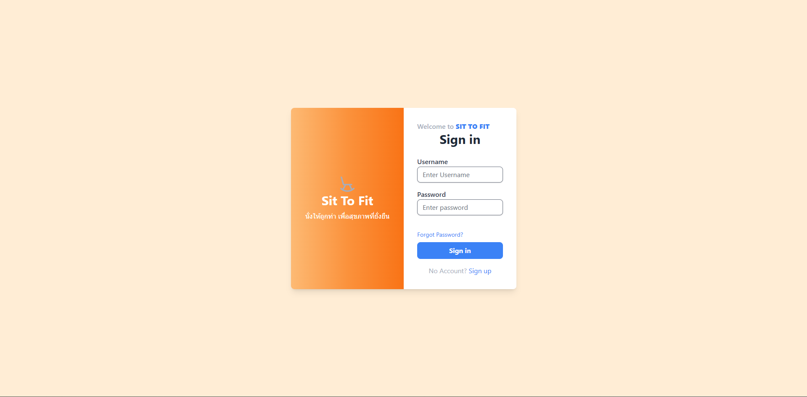
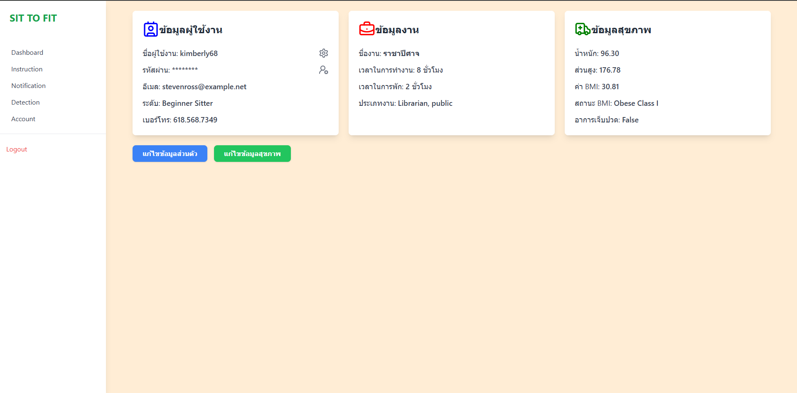
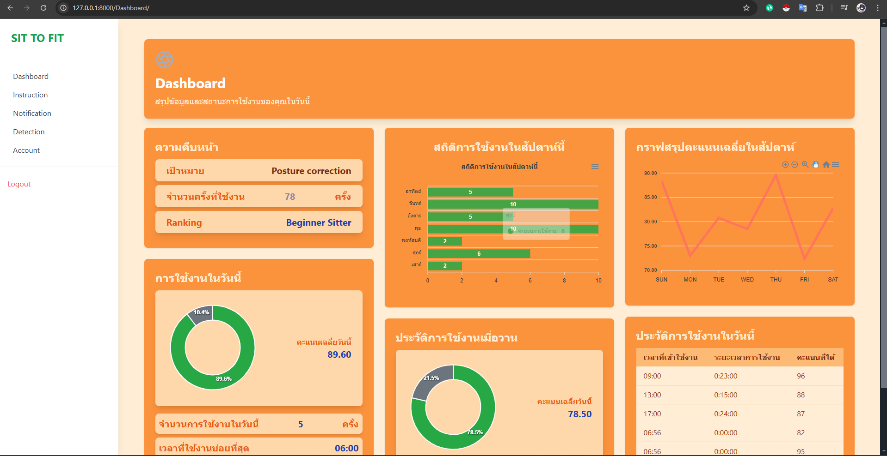

# SIT TO FIT

รายละเอียดโครงการ

SIT TO FIT เป็นระบบที่ช่วยติดตามและประเมินพฤติกรรมการนั่งทำงานหรือเรียนรู้ของผู้ใช้งาน โดยมุ่งเน้นการพัฒนาให้ผู้ใช้งานสามารถปรับปรุงสุขภาพและการนั่งทำงานได้อย่างมีประสิทธิภาพ ผ่านการตรวจจับข้อมูลและการแสดงผลที่เข้าใจง่าย

# ความคืบหน้าในปัจจุบัน

1. ระบบAutentification

2. ระบบแสดงหน้าต่างผู้ใช้งาน(AccountView)

3. ระบบแสดงแผนภาพแสดงความคืบหน้า(Dashborad)

4. ระบบแจ้งเตือน ด้วยการใช้ FCM

# Installazion
1. npm install tailwindcss postcss autoprefixer 
2. npm install postcss-simple-vars --save-dev
3. npm install @tailwindcss/forms --save-dev
4. npm install @tailwindcss/typography --save-dev
5. npm install @tailwindcss/aspect-ratio --save-dev
6. npm install daisyui --save-dev
